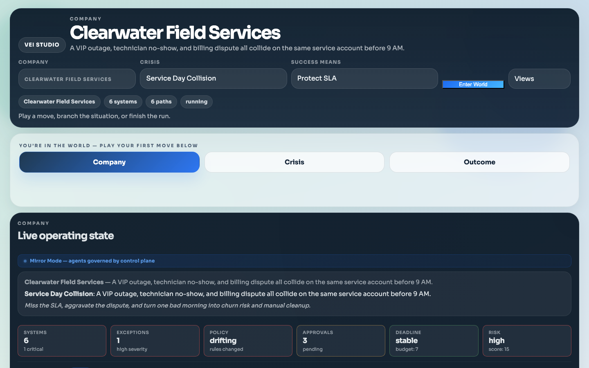
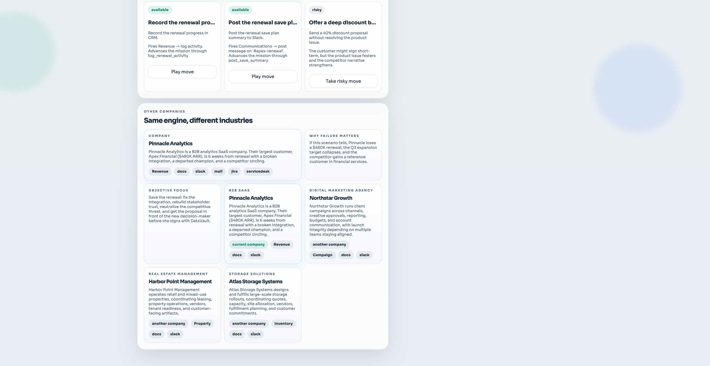
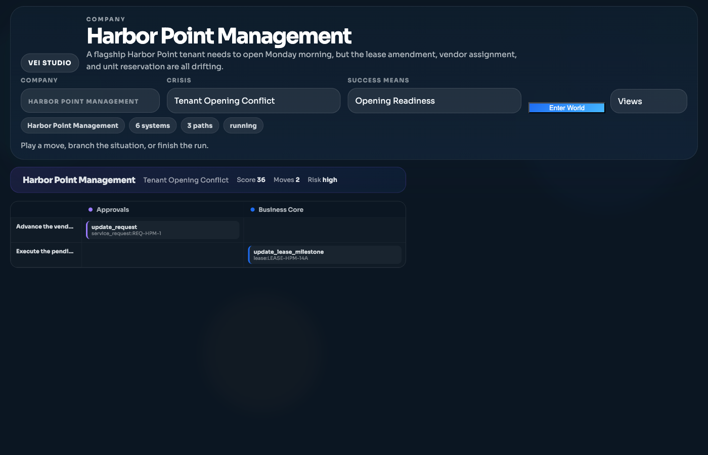
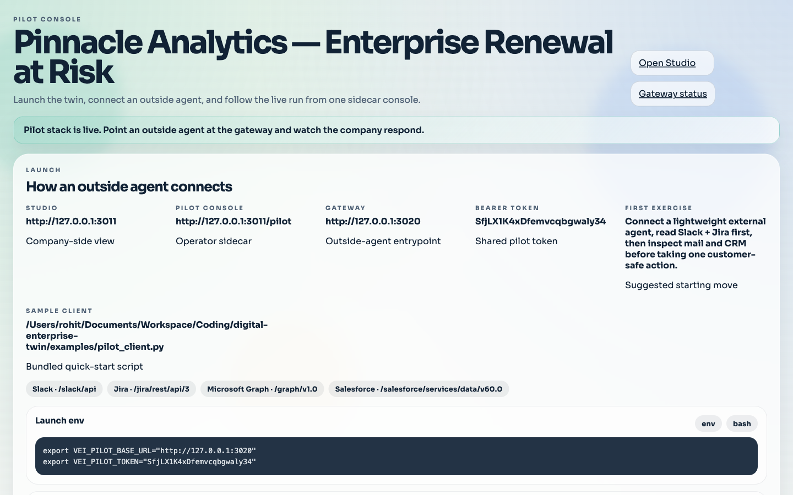
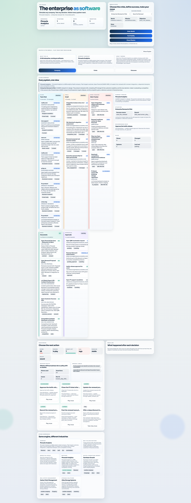

## VEI
[](https://deepwiki.com/strangeloopcanon/vei)



VEI builds believable company worlds and lets you run a control layer on top of them.

You can use it to turn a real or obfuscated company into a branchable enterprise twin, run policies and multi-step workflows against that twin, replay the same starting point with different rules, and show the outcome as a live demo, evaluation run, rollout, or training trace.

The cleanest way to think about VEI is: **one kernel, four modes**.

- **Test / Eval** — prove an agent works before it touches a real company. Run deterministic benchmarks, grade outcomes against typed contracts, and compare scripted vs LLM vs workflow runners over the same starting state.
- **Mirror / Control** — watch real or demo agents act through VEI and govern risky writes. A control plane panel shows each agent's status, last action, and denial history. Surface-access enforcement blocks agents from unauthorized surfaces, and denied actions appear in the run timeline. A mode indicator makes governance visible at all times.
- **Sandbox / What-if** — branch the same company world and compare alternate outcomes. Fork a playable mission from any historical snapshot, compare two paths side by side with assertion diffs, and drill into a cross-run world-state diff grouped by domain to see exactly how strategies diverged.
- **Train / Data** — generate rollouts, traces, and datasets for cloning or RL-style updates. Export completed runs as trajectory data for behavioral cloning or reinforcement learning.

Pick a company, pick a crisis, define what success looks like, then play moves or let an agent play them. Every tool, every person, and every process reacts as one connected system.

Today VEI is best thought of as the engine underneath a customer-facing control product: the repo contains the world model, policy and workflow runtime, replay and scoring loop, mirror gateway with surface-access enforcement, playable demo surfaces with sandbox forking and path comparison, and rollout or training hooks.

**[Full overview: what this is, who it's for, and how to connect your own data →](docs/OVERVIEW.md)**

Use this README for installation and operator quickstart. Use `docs/OVERVIEW.md` for product framing, `docs/ARCHITECTURE.md` for internals, and `docs/BENCHMARKS.md` for evaluation flows.

## What VEI Simulates

VEI simulates a complete enterprise environment — every software system, every person, every process — as one deterministic, branchable world. An agent (or a human) discovers what systems exist, inspects state, takes actions that ripple across all tools simultaneously, and is evaluated against business constraints.

**What is simulated:**

- **Software surfaces** — Slack, Email, Browser, Docs, Spreadsheet, Tickets, CRM, ERP, Okta-style identity, ServiceDesk, Google Admin, SIEM, Datadog, PagerDuty, feature flags, HRIS, and Jira-style issues. One move in one system can trigger visible changes across all the others.
- **Vertical company worlds** — Each vertical is a complete company with realistic seed data across all surfaces:
  - **Pinnacle Analytics** (B2B SaaS) — $480K enterprise renewal at risk, broken integration, departed champion, competitor circling
  - **Harbor Point Management** (Real Estate) — Flagship tenant opening with lease, vendor, and property-readiness pressure
  - **Northstar Growth** (Marketing Agency) — Campaign launch with approval, pacing, and reporting risk
  - **Atlas Storage Systems** (Storage/Logistics) — Strategic customer quote with fragmented capacity
  - **Clearwater Field Services** (Service Operations) — VIP outage, technician no-show, and billing dispute colliding on the same account
- **Time and state** — Virtual time, scheduled events, snapshots, branches, replay, and restore
- **Policies and outcomes** — Success predicates, forbidden states, policy invariants, observation boundaries, deadlines, and contract-graded outcomes
- **Long-horizon work** — Multi-step tasks that cross systems, have hidden state, require follow-through, and can fail midway

**How the simulation works:**

1. A `BlueprintAsset` declares the company: its org structure, tool data (Slack channels, email threads, tickets, docs, CRM deals), and domain objects (leases, campaigns, capacity pools, etc.)
2. The blueprint compiles into a `WorldSession` — a deterministic kernel that owns all state, event queues, and tool dispatch
3. A `Scenario` overlays pressure on the world (a crisis, a deadline, a fault injection)
4. A `Contract` defines what success looks like (predicates, invariants, reward terms)
5. Actions flow through MCP tools, resolve to capability-graph mutations, and produce observable side effects across every surface simultaneously
6. The entire run is recorded as an append-only event spine — replayable, branchable, and gradeable

Each world pack supports multiple scenario variants and contract variants, so the same company can be placed under different pressures with different success criteria. The same packs also ship as playable missions for human step-through.





## Core Primitives

VEI now exposes one coherent product shape:

- `Blueprint`: typed composition of scenario, facades, workflow, and contract
- `BlueprintAsset`: authored blueprint root that declares a scenario template, capability-graph or environment seed, requested facades, workflow, and metadata
- `CompiledBlueprint`: compiled blueprint with resolved facades, state roots, workflow defaults, contract defaults, and run defaults
- `GroundingBundle`: typed imported org/policy/incident input that compiles into a `BlueprintAsset`
- `ImportPackage`: raw CSV/JSON enterprise export pack plus mapping profiles, redaction state, and provenance anchors
- `Workspace`: file-backed environment root that stores blueprint, contracts, scenarios, imports, runs, and artifacts
- `Scenario`: seeded enterprise world and difficulty/tool manifest
- `Facade`: typed enterprise surface grouped by capability domain
- `Contract`: success predicates, forbidden predicates, observation boundary, policy invariants, reward terms, and intervention rules
- `Run`: workflow, benchmark, demo, and suite executions over the same world kernel
- `Snapshot`: branchable world-state checkpoint with replay and receipts

The older per-app router twins are still used, but they are now wrapped as a typed facade catalog rather than presented as the product ontology by themselves.

VEI is semantic-first today. VM-backed desktop or OS-level facades can come later as plugins, but the current engine is intentionally focused on compiling organization state and policies into a deterministic world before adding heavier substrates.

## License

This repository is licensed under the Business Source License 1.1 in [LICENSE](LICENSE).

- Additional Use Grant: `None`
- Change Date: `2030-03-10`
- Change License: `GPL-2.0-or-later`

## Quick Start

### Install

```bash
pip install -e ".[llm,sse,ui]"
```

Add `.[browser]` if you want animated GIF export from `vei visualize export`.

### Configure `.env`

```env
OPENAI_API_KEY=sk-your-key
VEI_SEED=42042
VEI_ARTIFACTS_DIR=./_vei_out
```

### Verify the repo

```bash
make setup
make check
make test
make llm-live
vei smoke run --transport stdio --timeout-s 30
```

`make llm-live` auto-loads `.env` when present and writes `summary.json`, `score.json`, `trace.jsonl`, `llm_metrics.json`, and transcript artifacts under `_vei_out/llm_live/latest`.

### Run a live episode

```bash
vei llm-test run \
  --provider openai \
  --model gpt-5 \
  --task "Research price, get Slack approval under budget, and email vendor for quote."
```

### Workspace and UI flow

```bash
vei project init --root _vei_out/workspaces/acquired_cutover --example acquired_user_cutover
vei contract validate --root _vei_out/workspaces/acquired_cutover
vei run start --root _vei_out/workspaces/acquired_cutover --runner workflow
vei ui serve --root _vei_out/workspaces/acquired_cutover
```

Or equivalently:

```bash
vei ui serve --root _vei_out/workspaces/acquired_cutover
```

The unified root CLI exposes the same lifecycle:

```bash
vei project show --root _vei_out/workspaces/acquired_cutover
vei scenario preview --root _vei_out/workspaces/acquired_cutover
vei inspect events --root _vei_out/workspaces/acquired_cutover
vei inspect graphs --root _vei_out/workspaces/acquired_cutover --domain identity_graph
```

The vertical demos now support the same company world under multiple futures and objective functions:

```bash
vei project init --root _vei_out/workspaces/harbor_point --vertical real_estate_management
vei scenario variants --root _vei_out/workspaces/harbor_point
vei scenario activate --root _vei_out/workspaces/harbor_point --variant vendor_no_show
vei contract variants --root _vei_out/workspaces/harbor_point
vei contract activate --root _vei_out/workspaces/harbor_point --variant safety_over_speed
vei run start --root _vei_out/workspaces/harbor_point --runner workflow
vei ui serve --root _vei_out/workspaces/harbor_point
```

That is the cleanest proof of the kernel thesis: the base company world stays fixed while VEI swaps the problem setup and success criteria on top of the same runtime, event spine, contract engine, and playback UI.

For the presentation path, VEI now ships a narrative-first Studio showcase:

```bash
vei showcase story \
  --root _vei_out/vertical_showcase \
  --run-id story_presentation \
  --vertical real_estate_management \
  --scenario-variant vendor_no_show \
  --contract-variant safety_over_speed

vei ui serve --root _vei_out/vertical_showcase/story_presentation/real_estate_management
```

That path writes:
- `story_manifest.json`
- `story_overview.md`
- `exports_preview.json`
- `presentation_manifest.json`
- `presentation_guide.md`

The point is product legibility: VEI now presents the demo as **Presentation → Company → Situation → Objective → Run → Branch → Outcome → Exports**, while the underlying kernel stays the same. The new presentation artifacts give you a clean live-demo flow on top of the same Studio workspace.

For the publishable local-product path, VEI now ships a mission-driven playable mode:

```bash
vei studio play \
  --root _vei_out/playable/harbor_point \
  --world real_estate_management \
  --mission tenant_opening_conflict
```

That command prepares the world, activates the mission and objective, records the baseline/comparison context, generates a twin-fidelity report, and serves Studio in Mission Mode. If you only want the bundle on disk, add `--no-serve`.

The default Studio front door is now the **Living Company View**. Instead of opening on a debug dashboard, it opens on a compact software wall with Slack, email, tickets, docs, approvals, and the vertical business system side by side. The seeded worlds are intentionally denser now, so each company feels like a real operating business before you even play a move, and visible tool panels update when moves land.

To build the wider local playable release:

```bash
vei showcase playable \
  --root _vei_out/playable_showcase \
  --run-id playable_release
```

That bundle writes:
- `fidelity_report.json`
- `playable_manifest.json`
- `playable_overview.md`

The new product-facing helpers are:

```bash
vei inspect fidelity --root _vei_out/playable/harbor_point
vei export mission-run --root _vei_out/playable/harbor_point --run-id human_play_... --format rl
```

### Customer-shaped agent twins

VEI can now turn captured company context into a customer-shaped twin and expose provider-style routes that an external agent can talk to directly.

Build a twin from a saved context snapshot:

```bash
vei twin build \
  --root _vei_out/customer_twins/acme_cloud \
  --snapshot _vei_out/context/acme_snapshot.json \
  --organization-domain acme.ai
```

Serve the compatibility gateway:

```bash
vei twin serve \
  --root _vei_out/customer_twins/acme_cloud \
  --host 127.0.0.1 \
  --port 3020
```

That workspace keeps the normal VEI run history, surfaces, scoring, and replay, while the gateway exposes provider-shaped routes for:
- Slack-style chat
- Jira-style issues
- Microsoft Graph-style mail and calendar
- Salesforce-style CRM

Mirror mode now has two practical entry paths:

- **Demo mode** — use staged built-in agents and timed activity on a simulated world so the control plane feels live without real credentials
- **Live alpha** — run the twin in `live` connector mode so Slack-shaped traffic can pass through VEI, be governed, and still update the twin

Mirror mode treats **proxy** and **ingest** as peers. If you control the agent, point it at VEI's compatibility routes. If you do not, register the agent and send typed events into the same run history instead. In both cases, the agent must be registered first; VEI no longer auto-creates mirror agents from traffic.

**Surface-access enforcement**: Each registered agent declares its `allowed_surfaces`. When an agent attempts to act on an unauthorized surface, VEI blocks the action, records a `mirror_denied` event in the run timeline, increments the agent's denial count, and returns a clear denied result. The control plane panel shows denial badges on agent cards and highlights blocked events in the activity log. The `record_only` path intentionally bypasses enforcement — passive observation agents can report telemetry without policy gating.

Try the demo-first path with the built-in service company:

```bash
vei twin build \
  --root _vei_out/customer_twins/clearwater \
  --snapshot _vei_out/context/acme_snapshot.json \
  --organization-domain clearwater.example.com \
  --archetype service_ops \
  --mirror-demo

vei twin serve --root _vei_out/customer_twins/clearwater
```

Or use the one-command path:

```bash
vei quickstart run --world service_ops --mirror-demo
```

**[Visual walkthrough of the service ops control plane: mirror mode, sandbox forking, path comparison, and world-state diff →](docs/SERVICE_OPS_WALKTHROUGH.md)**

For the first live slice, keep the same twin but flip the connector mode:

```bash
vei twin build \
  --root _vei_out/customer_twins/clearwater_live \
  --snapshot _vei_out/context/acme_snapshot.json \
  --organization-domain clearwater.example.com \
  --archetype service_ops \
  --connector-mode live
```

Today VEI is authoritative for actions it directly proxies or ingests. For the Slack-first live alpha, unsupported surfaces still read from the last synced twin snapshot, but writes fail clearly until a real live adapter exists. That is an intentional alpha limit.

The fastest way to inspect what was built is:

```bash
vei twin status --root _vei_out/customer_twins/acme_cloud
```

### Pilot stack

VEI also ships a higher-level pilot flow for local agent demos. It starts the customer twin gateway, Studio, and a separate Pilot Console sidecar, then writes a launch manifest and short handoff guide for the person running the exercise.

```bash
vei pilot up --root _vei_out/pilots/pinnacle
vei pilot status --root _vei_out/pilots/pinnacle
```

That flow writes:
- `pilot_manifest.json`
- `pilot_guide.md`
- `pilot_runtime.json`

The Pilot Console lives beside Studio on the same UI server and gives the operator one place to check launch details, copy connection snippets, follow external-agent activity, and reset or finalize the run.



You can also use the bundled quick-start client:

```bash
python examples/pilot_client.py \
  --base-url http://127.0.0.1:3020 \
  --token YOUR_PILOT_TOKEN \
  --post-message "Customer-safe update is ready for review."
```

When you are done:

```bash
vei pilot down --root _vei_out/pilots/pinnacle
```

### Grounded import flow

VEI can now ingest realistic offline enterprise export packs and turn them into a runnable workspace. The import path is:

```text
raw CSV/JSON exports -> import package -> review/override -> normalized grounding bundle -> compiled workspace
```

Canonical fixture demo:

If you are running from a source checkout, the bundled fixture lives under `vei/imports/fixtures/`. In an installed environment, resolve its packaged path with `python -c "from vei.imports.api import get_import_package_example_path; print(get_import_package_example_path('macrocompute_identity_export'))"`.

```bash
cp -R vei/imports/fixtures/macrocompute_identity_export _vei_out/import_packages/macrocompute_identity_export
vei project validate-import --package _vei_out/import_packages/macrocompute_identity_export
vei project review-import --package _vei_out/import_packages/macrocompute_identity_export
vei project scaffold-overrides --package _vei_out/import_packages/macrocompute_identity_export --source-id okta_users
vei project normalize --package _vei_out/import_packages/macrocompute_identity_export
vei project import --root _vei_out/workspaces/macrocompute_import --package _vei_out/import_packages/macrocompute_identity_export
vei scenario generate --root _vei_out/workspaces/macrocompute_import
vei scenario activate --root _vei_out/workspaces/macrocompute_import --scenario-name oversharing_remediation --bootstrap-contract
vei run start --root _vei_out/workspaces/macrocompute_import --runner workflow --scenario-name oversharing_remediation
vei inspect provenance --root _vei_out/workspaces/macrocompute_import --object-ref drive_share:DOC-ACQ-1
vei ui serve --root _vei_out/workspaces/macrocompute_import
```

If you want the shortest end-to-end grounded identity flow, VEI now ships a single command that prepares the workspace, generates/activates the right scenario, bootstraps the contract, and can launch the baseline plus scripted comparison runs:

```bash
vei project identity-demo --root _vei_out/workspaces/identity_demo --overwrite
vei ui serve --root _vei_out/workspaces/identity_demo
```

Live source sync uses the same persisted import-package model. For the first connector-backed path, point VEI at a read-only Okta config JSON:

```json
{
  "base_url": "https://your-org.okta.com",
  "token_env": "OKTA_API_TOKEN",
  "organization_name": "Your Organization",
  "organization_domain": "example.com"
}
```

Then sync it into an existing workspace:

```bash
vei project sync-source --root _vei_out/workspaces/macrocompute_import --connector okta --config _vei_out/okta.json
vei project review-import --root _vei_out/workspaces/macrocompute_import
vei project compile --root _vei_out/workspaces/macrocompute_import
```

The import UI now shows:
- package/source summary
- connected source registry and sync history
- mapping diagnostics
- identity reconciliation across imported users, employees, managers, and share principals
- suggested override locations and applied source overrides
- generated scenario candidates
- imported vs derived vs simulated counts
- contract rule provenance, including which rules were imported vs inferred
- active generated-scenario promotion into the workspace run path
- provenance drilldown from selected run events

## What You Get

- Deterministic simulator with replayable traces
- Stable world-kernel API with snapshot, branch, restore, replay, inject, and event inspection
- File-backed workspaces that keep blueprint assets, contracts, scenarios, runs, and artifacts together
- Typed blueprint and facade catalog over the existing enterprise twins
- Blueprint compiler with explicit facade plugins and authored `GroundingBundle -> BlueprintAsset -> CompiledBlueprint` flow
- Environment-builder path that can compile typed capability graphs, policies, and workflow seeds into a runnable world session
- Grounded import pipeline that can validate file-based identity exports, normalize them into a `GroundingBundle`, generate scenario candidates, bootstrap contracts, and preserve provenance/redaction artifacts inside a workspace
- Multi-source identity reconciliation that explains how Okta-style users, HRIS employees, manager references, and share/request principals were resolved, left unmatched, or marked external
- Connector-backed import pipeline that can sync a live read-only Okta snapshot into the same canonical `ImportPackage -> GroundingBundle -> Workspace` ladder used by file exports
- Runtime capability-graph layer that lets world sessions and snapshots expose shared domain graphs such as identity, docs, work, comms, and revenue
- Graph-native planning and mutation layer that lets agents ask for suggested next actions and apply graph actions without dropping down to raw app tools first
- Graph-native workflow execution, so benchmark/playbook steps can compile to `vei.graph_action` instead of only raw app-shaped tool calls
- Vertical world packs for B2B SaaS, real estate management, digital marketing agencies, and storage-solutions companies with built-in scenario variants, contract variants, and curated “same world, many futures” demo paths
- Context capture layer that pulls live enterprise data from Slack, Jira, Google Workspace, and Okta into a structured `ContextSnapshot`, then hydrates a `BlueprintAsset` from it
- Synthesis layer that extracts runbooks, training data (conversations, trajectories, demonstrations), and agent configurations from completed world runs
- Agent-orientation layer that lets sessions and snapshots expose agent-facing summaries of visible surfaces, active policies, key objects, and suggested next questions
- Enterprise twins for Slack, Mail, Browser, Docs, Spreadsheet, Tickets, DB, ERP/CRM, Okta-style identity, ServiceDesk, Google Admin, SIEM, Datadog, PagerDuty, feature flags, HRIS, and Jira-style issue flows
- Scenario compilation, dataset rollout, BC training, benchmark execution, and release packaging
- Reusable benchmark families for security containment, enterprise onboarding/migration, and revenue incident response
- Curated complex-example showcase bundles for security incidents, acquired-user cutovers, and revenue-critical mixed-stack mitigations
- Local playback UI for completed and in-flight workspace runs, including timeline, orientation, capability graphs, snapshots, diffs, and contract outcome panels
- Canonical append-only run event stream that drives playback, `vei inspect events`, receipts, contract status, and snapshot markers across workflow, scripted, BC, and LLM runs
- Variant-aware workspace activation so previews, run manifests, showcase bundles, and the UI all explain which scenario overlay and contract overlay are active on top of the base world
- VEI Studio narrative mode, so the same kernel can be shown as a world studio for enterprises with company briefings, situation/objective selection, branch/outcome explanation, and export previews for future RL/eval/agent-ops layers
- Mission-driven playable Studio mode, where the same kernel now acts like a work-game runtime with human moves, scorecards, branch points, and twin-fidelity checks
- Mirror control plane with surface-access enforcement, per-agent denial tracking, bounded recent-event feed, and a two-column agent/activity panel in the Studio UI
- Sandbox forking from any historical snapshot with move-history rewind, cross-run world-state diffing grouped by domain, and side-by-side path comparison with assertion-level divergence

## Architecture

```text
Agent ──MCP──► VEI Router                       External Agent ──HTTP──► Twin Gateway (:3012)
                  └─ transport + tool dispatch                              ├─ Slack / Jira / Graph / SFDC compat routes
                            │                                               ├─ mirror agent registry
                            ▼                                               ├─ surface-access enforcement
                      WorldSession Kernel ◄─────────────────────────────────┘
                  ├─ unified world state
                  ├─ snapshots / branch / replay / inject
                  ├─ actor state + receipts
                  ├─ enterprise twins (15+ surfaces)
                  └─ mirror runtime (agent fleet, denial tracking, event feed)
                            │
                            ▼
                      Studio UI (:3011)
                  ├─ Living Company View + mode indicator
                  ├─ Control Plane panel (agents + activity log)
                  ├─ Mission play + sandbox forking
                  └─ Path comparison + world-state diff
```

## Next Phase

The current execution-ready roadmap lives in [docs/NEXT_PHASE_PLAN.md](docs/NEXT_PHASE_PLAN.md).

In one line: the next phase is about making `vei.run` the canonical execution spine and making VEI much stronger at turning messy enterprise exports into runnable, inspectable, contract-graded identity environments.

## Use It As A Library

Install directly from GitHub:

```bash
pip install "git+https://github.com/strangeloopcanon/vei.git@main"
```

For the full product workflow, including the local UI and live LLM runs:

```bash
pip install -e ".[llm,sse,ui]"
```

SDK embedding:

```python
from vei.sdk import create_session

session = create_session(seed=42042, scenario_name="multi_channel")
obs = session.observe()
page = session.call_tool("browser.read", {})
```

World-kernel embedding:

```python
from vei.world.api import create_world_session, get_catalog_scenario

world = create_world_session(
    seed=42042,
    scenario=get_catalog_scenario("multi_channel"),
)
obs = world.observe()
snapshot = world.snapshot("before-run")
events = world.list_events()
```

Useful helpers:

- Scenario manifests: `list_scenario_manifest()`, `get_scenario_manifest(name)`
- Facade catalog: `list_facade_manifest_entries()`, `get_facade_manifest_entry(name)`
- Blueprint catalog: `list_blueprint_entries()`, `build_blueprint_asset_for_family_entry(name)`, `build_blueprint_for_family_entry(name)`, `compile_blueprint_entry(asset)`
- Environment builder: `list_blueprint_builder_examples_entries()`, `build_blueprint_asset_for_example_entry(name)`, `create_world_session_from_blueprint_entry(asset)`
- Workspace lifecycle: `create_workspace_from_template_entry(...)`, `import_workspace_entry(...)`, `compile_workspace_entry(...)`, `show_workspace_entry(...)`
- Import helpers: `list_import_package_example_entries()`, `validate_import_package_entry(path)`, `review_import_package_entry(path)`, `scaffold_mapping_override_entry(path, source_id=...)`, `normalize_import_package_entry(path)`, `load_workspace_import_review_entry(root)`, `load_workspace_provenance_entry(root, object_ref)`
- Run lifecycle: `launch_workspace_run_entry(...)`, `list_run_manifests_entry(...)`, `get_run_orientation_entry(...)`, `get_run_capability_graphs_entry(...)`
- Benchmark families: `list_benchmark_family_manifest_entries()`, `get_benchmark_family_manifest_entry(name)`
- Release packaging: `build_release_version()`, `export_release_dataset(...)`, `export_release_benchmark(...)`, `run_release_nightly(...)`

## Primary Commands

```bash
make setup
make check
make test
make llm-live
make deps-audit
make all
```

If you do not have LLM credentials:

```bash
VEI_LLM_LIVE_BYPASS=1 make llm-live
```

## Supported CLI Surface

- Start here
  - `vei quickstart run` — one-command demo with Studio + Twin Gateway
  - `vei project|contract|scenario|run|inspect|showcase|ui`
  - `vei ui serve`
  - `vei studio play` (mission-driven playable mode)
- Twin and mirror
  - `vei twin build|serve|status` — build and serve customer-shaped twins
  - `vei pilot up|status|down|reset|finalize` — operator sidecar for agent exercises
- Context and synthesis
  - `vei context capture|hydrate|diff`
  - `vei synthesize runbook|training-set|agent-config`
- Expert tools
  - `vei world`
  - `vei blueprint bundle|bundles|asset|compile|show|observe|orient|examples|facades`
  - `vei visualize replay|flow|dashboard|export`
- Benchmarking
  - `vei bench list` — list scenarios, vertical packs, and benchmark families
  - `vei bench run` — run benchmarks against scenarios and produce a scorecard
  - `vei bench scorecard` — render a scorecard from existing results
- Evaluation and release
  - `vei eval`, `vei rollout`, `vei train`, `vei score`, `vei release`
- Catalog/debug surfaces
  - `vei scenarios list|manifest|dump`
  - `vei smoke`, `vei demo`, `vei det sample-workflow|compile-workflow|run-workflow|generate-corpus|filter-corpus`

`vei inspect graphs` is now the broadest product/workspace graph surface. It can inspect `identity_graph`, `doc_graph`, `work_graph`, `comm_graph`, `revenue_graph`, `ops_graph`, `obs_graph`, and `data_graph` from a recorded run. `vei world graphs` remains the expert snapshot-level surface and currently focuses on `comm_graph`, `doc_graph`, `work_graph`, `identity_graph`, and `revenue_graph`. `vei world orient` and `vei blueprint orient` add the agent-facing layer on top: visible surfaces, active policy hints, key objects, and suggested next questions.

The product CLI also now supports built-in vertical demo worlds:

```bash
vei project init --root _vei_out/workspaces/pinnacle --vertical b2b_saas
vei project init --root _vei_out/workspaces/harbor_point --vertical real_estate_management
vei project init --root _vei_out/workspaces/northstar_growth --vertical digital_marketing_agency
vei project init --root _vei_out/workspaces/atlas_storage --vertical storage_solutions
```

Inside live MCP sessions, agents can now call the same discoverability surfaces directly with `vei.orientation`, `vei.capability_graphs`, `vei.graph_plan`, and `vei.graph_action`.

Graph-native agent ladder:

```text
vei.orientation
  -> what kind of world is this?
vei.capability_graphs
  -> what shared domain state exists?
vei.graph_plan
  -> what graph-native actions make sense next?
vei.graph_action
  -> apply one of those actions through the real twins
```

The workflow layer now uses the same abstraction too: flagship onboarding and revenue/ops workflows execute graph-native steps internally and only resolve down to concrete twins at runtime.

## Workspace And Playback UI

The default product-shaped loop is now:

1. `vei project init` or `vei project import`
2. `vei project compile` when you want to refresh compiled artifacts after editing the workspace; `init`, `import`, and `run start` already compile for you
3. `vei contract validate` and `vei scenario preview`
4. `vei run start --runner workflow|scripted|bc|llm`
5. `vei inspect orient|graphs|events|snapshots|diff|receipts`
6. `vei ui serve`

The local UI stays intentionally lightweight and Python-first. It opens one workspace, shows compiled scenario and contract context, launches runs with scenario/runner/provider/model/task/max-step controls, and renders a playback control room with animated channel lanes, run scorecards, capability-graph summaries, orientation cards, snapshot diffs, and raw developer drawers over the same canonical run artifacts.

Run playback is now driven by the canonical append-only event spine, so live and completed runs share the same source of truth for contract updates, snapshot markers, resolved tools, and graph-native intents like `identity_graph.assign_application` or `doc_graph.restrict_drive_share`.



The Studio front door is the Living Company view: Slack, email, tickets, docs, approvals, and the vertical business system displayed side by side as a software wall. Moves land visibly across all surfaces. The three-tab navigation (Company, Crisis, Outcome) keeps the audience focused.

When mirror mode is active, a mode indicator banner appears at the top of the Company view and the control plane panel shows agent cards with denial badges alongside a live activity log. The Outcome tab exposes a "Compare Paths" button, always-visible run pickers, snapshot cards with "Fork from here" buttons, and a world-state diff view that groups changes by domain with humanized keys.

Imported workspaces add a grounded-intake layer on top of that same UI: source-package health, normalization diagnostics, scenario candidates, imported/derived/simulated object counts, and provenance drilldown from timeline events to raw-source lineage.

## Benchmarking

Baseline run:

```bash
export VEI_ARTIFACTS_DIR=_vei_out/llmtest
VEI_SEED=42042 vei llm-test run \
  --provider openai \
  --model gpt-5 \
  --max-steps 32 \
  --task "Open product page, cite specs, post approval under $3200, email sales@macrocompute.example for a quote, wait for reply."
vei score --artifacts-dir _vei_out/llmtest --success-mode full
```

Kernel-backed benchmark run:

```bash
vei eval benchmark \
  --runner scripted \
  --scenario multi_channel \
  --artifacts-root _vei_out/benchmark \
  --run-id scripted_multi
```

Family-level benchmark run:

```bash
vei eval benchmark \
  --runner workflow \
  --family security_containment \
  --artifacts-root _vei_out/benchmark \
  --run-id security_workflow
```

Explicit workflow selection for a single scenario:

```bash
vei eval benchmark \
  --runner workflow \
  --scenario oauth_app_containment \
  --workflow-name security_containment \
  --workflow-variant internal_only_review \
  --artifacts-root _vei_out/benchmark \
  --run-id security_named_workflow
```

Scripted or LLM family runs stay on the same pipeline:

```bash
vei eval benchmark \
  --runner scripted \
  --family security_containment \
  --artifacts-root _vei_out/benchmark \
  --run-id security_family
```

Canonical family demo flow:

```bash
vei eval demo \
  --family security_containment \
  --artifacts-root _vei_out/demo \
  --run-id security_demo
```

That command runs the deterministic family workflow baseline plus a comparison runner, writes `leaderboard.md` / `leaderboard.csv` / `leaderboard.json`, stores inspectable world state under `_vei_out/demo/security_demo/state` for follow-up `vei world` inspection, and records explicit `contract.json` artifacts for both the baseline and comparison paths. Contract evaluation now separates oracle state from agent-visible observation so hidden state can be graded without making the demo omniscient.

Complex-example showcase bundle:

```bash
vei eval showcase \
  --artifacts-root _vei_out/showcase \
  --run-id flagship_examples
```

That command runs three curated complex examples and writes one top-level `showcase_overview.md` bundle plus per-example demo artifacts:

- `oauth_incident_chain`: Google Admin + SIEM + Jira + Docs + Slack
- `acquired_seller_cutover`: HRIS + Okta + Google Admin + Salesforce + Jira + Docs + Slack
- `checkout_revenue_flightdeck`: Datadog + PagerDuty + feature flags + Spreadsheet + Docs + CRM + Tickets + Slack

It is the cleanest supported way to show that VEI can execute long-horizon, cross-surface enterprise tasks rather than only single-family demos.

Vertical world-pack showcase bundle:

```bash
vei showcase verticals \
  --root _vei_out/vertical_showcase \
  --run-id world_showcase
```

That command creates four separate workspace-backed companies, runs the deterministic workflow baseline plus a freer comparison runner for each, and writes one `vertical_showcase_overview.md` bundle alongside ready-to-open workspace roots:

- `b2b_saas`: Pinnacle Analytics / `enterprise_renewal_risk`
- `real_estate_management`: Harbor Point Management / `tenant_opening_conflict`
- `digital_marketing_agency`: Northstar Growth / `campaign_launch_guardrail`
- `storage_solutions`: Atlas Storage Systems / `capacity_quote_commitment`

The point of that showcase is not just four flashy demos. It is one proof repeated four times:

- the same world kernel compiles four different businesses into runnable environments
- the same event spine records every run, graph action, tool resolution, and snapshot
- the same contract engine judges deterministic baselines and freer agent runs
- the same playback UI makes the result inspectable

That is why VEI can later become an RL environment, a continuous eval system, and an AI-agent operations platform on top of the same kernel.

Flagship blueprint-driven revenue/ops demo:

```bash
vei blueprint asset \
  --family revenue_incident_mitigation \
  --workflow-variant revenue_ops_flightdeck

vei blueprint compile \
  --family revenue_incident_mitigation \
  --workflow-variant revenue_ops_flightdeck

vei eval demo \
  --family revenue_incident_mitigation \
  --artifacts-root _vei_out/demo \
  --run-id revenue_ops_demo
```

That flow shows the full engine shape: authored `BlueprintAsset`, compiled blueprint, the deterministic workflow baseline, a freer comparison run, `contract.json`, and inspectable state/snapshot artifacts. The flagship revenue workflow now spans Spreadsheet, Docs, CRM, feature flags, Datadog, PagerDuty, Tickets, and Slack in one mixed-stack run.

Flagship environment-builder example for the identity/access-governance wedge:

```bash
vei blueprint examples

vei blueprint bundle \
  --example acquired_user_cutover

vei blueprint asset \
  --example acquired_user_cutover

vei blueprint compile \
  --example acquired_user_cutover

vei blueprint observe \
  --example acquired_user_cutover \
  --focus slack
```

That flow shows the full builder ladder: raw grounding bundle, authored blueprint asset, compiled blueprint, and then a live world observation. The current built-in identity wedge compiles capability graphs for HRIS, Okta-style identity, Google Drive sharing state, Jira tracking, docs, Slack, and CRM handoff.

Agent-facing builder orientation:

```bash
vei blueprint orient \
  --example acquired_user_cutover
```

That command renders the compiled blueprint, runtime capability graphs, and a concise orientation payload for the live world. It is the cleanest single command for showing what an LLM can discover about the environment before acting.

Canonical multi-family workflow suite:

```bash
vei eval suite \
  --artifacts-root _vei_out/suite \
  --run-id nightly_suite
```

That command runs each family's primary workflow variant and writes stable `leaderboard.*` artifacts plus `suite_result.json`, which makes it a good fit for CI or nightly publishing. Each family case also writes a `contract.json` artifact so the suite has an explicit contract layer, not just score files.

Frontier batch for one model:

```bash
vei eval benchmark \
  --runner llm \
  --model gpt-5 \
  --frontier \
  --scenario-set reasoning \
  --artifacts-root _vei_out/frontier_eval
```

Artifacts from batch evaluation include:

- `aggregate_results.json`
- per-scenario `benchmark_result.json`
- benchmark runs also write `blueprint_asset.json`
- benchmark runs also write `blueprint.json`
- `benchmark_summary.json`
- benchmark-family runs also write `contract.json`
- demo runs also write `leaderboard.md`, `leaderboard.csv`, `leaderboard.json`, and `demo_result.json`
- suite runs also write `leaderboard.md`, `leaderboard.csv`, `leaderboard.json`, and `suite_result.json`
- family-level dimension scores such as evidence preservation, blast radius, least privilege, oversharing avoidance, deadline compliance, revenue impact handling, artifact follow-through, comms correctness, and safe rollback

Render a report from any benchmark or frontier batch:

```bash
vei report generate \
  --root _vei_out/frontier_eval/<run-id> \
  --format markdown \
  --output LEADERBOARD.md
```

## Release Bundles

```bash
vei release dataset \
  --input-path _vei_out/rollout.json \
  --label rollout \
  --version v20260310

vei release benchmark \
  --benchmark-dir _vei_out/benchmark/scripted_multi \
  --label scripted-benchmark \
  --version v20260310

vei release nightly \
  --release-root _vei_out/releases \
  --workspace-root _vei_out/nightly \
  --version nightly-20260310 \
  --environments 5 \
  --scenarios-per-environment 5 \
  --rollout-episodes 2 \
  --benchmark-scenario multi_channel
```

## One-Command Demo

The fastest way to see VEI in action:

```bash
vei quickstart run
```

This creates a workspace from a built-in vertical, starts both the Studio UI
(`:3011`) and the Twin Gateway (`:3012`), runs a scripted baseline so you
immediately see events flowing, and prints connection details including mock
API URLs and an auth token. Press Ctrl-C to stop.

Options: `--world service_ops`, `--mirror-demo`, `--connector-mode live`,
`--studio-port`, `--gateway-port`, `--seed`, `--no-baseline`.

## Test Your Agent Against VEI

```
┌─────────────┐     HTTP / MCP      ┌──────────────────┐     call_tool      ┌──────────────┐
│  Your Agent │ ──────────────────► │  Twin Gateway    │ ────────────────► │  WorldSession │
│  (any lang) │ ◄────────────────── │  :3012           │ ◄──────────────── │  Kernel       │
└─────────────┘   Slack/Jira/SFDC   └──────────────────┘   state + events  └──────────────┘
                   shaped responses         │                                      │
                                            ▼                                      ▼
                                   Contract Evaluation                      Event Spine
                                   (pass/fail/score)                       (events.jsonl)
```

1. **Start VEI**: `vei quickstart run` (or `vei twin serve --root workspace`)
2. **Connect your agent** to the mock API endpoints printed on startup — Slack,
   Jira, MS Graph, Salesforce — using the bearer token shown
3. **Your agent takes actions** (sends Slack messages, transitions Jira tickets,
   queries Salesforce) and VEI responds with coherent, stateful results
4. **VEI evaluates** against the contract (success predicates, forbidden
   predicates, policy invariants) and produces a scorecard
5. **Inspect results** in the Studio UI timeline view, or read the run artifacts
   (`events.jsonl`, contract evaluation, snapshots)

For MCP-native agents, connect directly:
`python -m vei.router`

## Examples

- `examples/sdk_playground_min.py`
- `examples/mcp_client_stdio_min.py`
- `examples/rl_train.py`
- `examples/pilot_client.py`

## Docs

- `docs/OVERVIEW.md` — What VEI is, who it's for, how to connect your data, and strategic context
- `docs/ARCHITECTURE.md` — Module structure and data flow
- `docs/BENCHMARKS.md` — Benchmark families, difficulty tiers, and evaluation
- `docs/SERVICE_OPS_WALKTHROUGH.md` — Visual walkthrough of the service ops control plane: mirror mode, surface-access enforcement, sandbox forking, path comparison, and world-state diff

## Contributor Notes

`bd` state is local-only under `.beads/` and should stay out of Git.

## Workspace Hygiene

The repo source of truth is:

- `vei/`
- `tests/`
- `docs/`
- `tools/`
- top-level config such as `pyproject.toml`, `Makefile`, `README.md`, and `.agents.yml`

Local-only generated folders such as `_vei_out/`, `.artifacts/`, `.mypy_cache/`, `.pytest_cache/`, `.ruff_cache/`, and `vei.egg-info/` are disposable.

To prune local clutter while keeping the current canonical demo, latest live artifact, reusable datasets, your virtualenv, local `bd` state, and local Codex state:

```bash
make clean-workspace
```

`archive_data/` is intentionally left alone by that target because it may contain local imported source data rather than regenerated outputs.
