# VEI Service Operations Pack — Visual Walkthrough

**Clearwater Field Services** — a simulated field service company where a VIP outage, technician no-show, and billing dispute all collide on the same service account before 9 AM.

This walkthrough captures the live Studio UI running the `service_ops` vertical pack with mirror mode enabled: mode indicator, control plane panel, situation room, policy change ceremony, governance UX, weighted scoring, sandbox forking, path comparison, and world-state diffing.

---

## 1. Entering the World

The Studio opens with the company identity front and center. Three controls configure the simulation:

- **Company**: Clearwater Field Services
- **Crisis**: Service Day Collision, Technician No-Show, or Billing Dispute Reopened
- **Success means**: Protect SLA, Protect Revenue, or Protect Customer Trust

Each objective weights assertions differently — Protect SLA values dispatch recovery 3x, Protect Revenue values billing holds 3x, and Protect Customer Trust values communication artifacts 3x. Same moves, different scores.

When mirror mode is active, a **mode indicator** appears below the company context: a blue banner with a pulsing dot reading "Mirror Mode — agents governed by control plane." This tells the operator immediately that autonomous agents are flowing through VEI's governance layer.

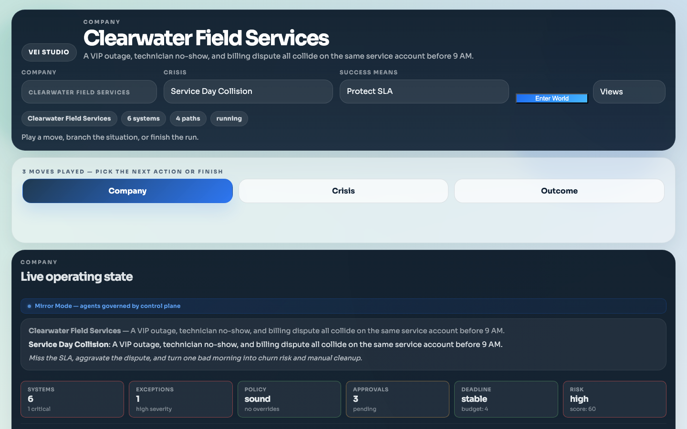

---

## 2. Situation Room Strip — Monday Morning at a Glance

Below the company context, a **situation room strip** shows the operator the full picture in 3 seconds:

| Cell | Value | Detail |
|------|-------|--------|
| Systems | 6 | 1 critical |
| Exceptions | 1 | high severity |
| Policy | sound | no overrides |
| Approvals | 3 | pending |
| Deadline | stable | budget: 4 |
| Risk | high | score: 60 |

Color-coded borders (green/amber/red) indicate which cells need attention. This strip updates after every move.

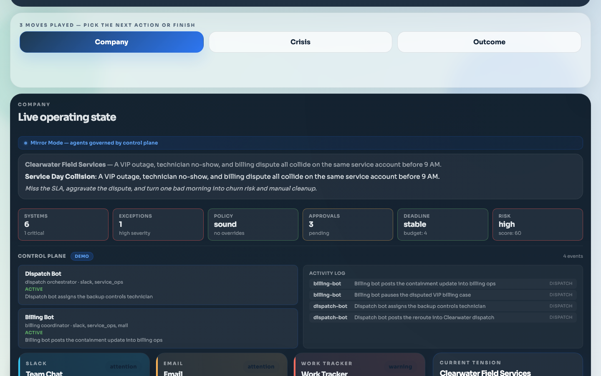

---

## 3. Control Plane — Mirror Mode in Action

Directly below the situation room, the **Control Plane** panel shows which autonomous agents are operating in this workspace. In mirror-demo mode, two agents are pre-seeded:

| Agent | Role | Surfaces | Status |
|-------|------|----------|--------|
| Dispatch Bot | dispatch orchestrator | slack, service_ops | active |
| Billing Bot | billing coordinator | slack, service_ops, mail | active |

The panel uses a two-column layout:

- **Left column — Agent cards**: Each card shows the agent name, role, allowed surfaces, status, last action performed, and a denial badge if any actions were blocked by surface-access enforcement. Cards with denials are highlighted with a red-tinted border.
- **Right column — Activity log**: A live feed of recent mirror events showing which agent acted, what they did, and how VEI handled it (dispatch, inject, denied). Denied events are called out with a "blocked" tag.

The header shows:
- **Mode badge**: "demo" (blue) for staged demonstrations, "live" (green) for real agent traffic
- **Denied count**: Total blocked actions (red pill) if any agent has been denied
- **Event counter**: Total events processed by the mirror runtime

This is the control plane — the human operator sees their agent fleet, enforcement decisions, and activity log at all times alongside system health.

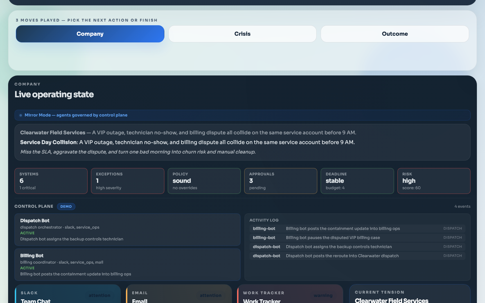

---

## 4. Live Operating State — Six Interconnected Systems

The Company view shows the full surface wall with all enterprise work surfaces:

- **Slack** (5 channels, 12+ messages) — CFO, COO, dispatch lead, technicians, billing ops
- **Email** (4 threads, 3 unread) — Urgent rooftop unit failure, billing dispute, technician sick call
- **Work Tracker** (5 active tickets) — VIP outage command, tech roster, backup dispatch, billing dispute
- **Documents** (5 artifacts) — VIP Account Brief, Response Runbook, Field-To-Billing Handoff, Dispatch Board, Billing Notes
- **Approvals** (4 routed requests) — VIP emergency dispatch, billing hold, customer comms, overtime
- **Service Loop** (Business Core) — Work orders, appointments, billing cases, exceptions

Mirror-initiated events appear as regular entries in these surfaces — when the Dispatch Bot posts to Slack or the Billing Bot holds a billing case, those actions show up here alongside human moves.

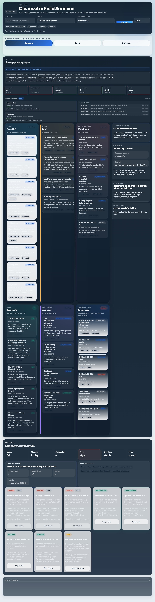

---

## 5. Mission Control — Scoring and Moves

The mission control panel tracks the current state:

| Metric | Value |
|--------|-------|
| Score | 60 |
| Mission | in play |
| Budget left | 4 |
| Risk | high |
| Deadline | stable |
| Policy | sound |

Move cards are categorized by availability:
- **Blocked/Used** — Already played on this branch
- **Recommended** — Resolve the finance exception, Update the handoff document
- **Available** — Write recovery note, Post ops summary
- **Risky** — Raise the hold threshold (amber chip, governance-gated)

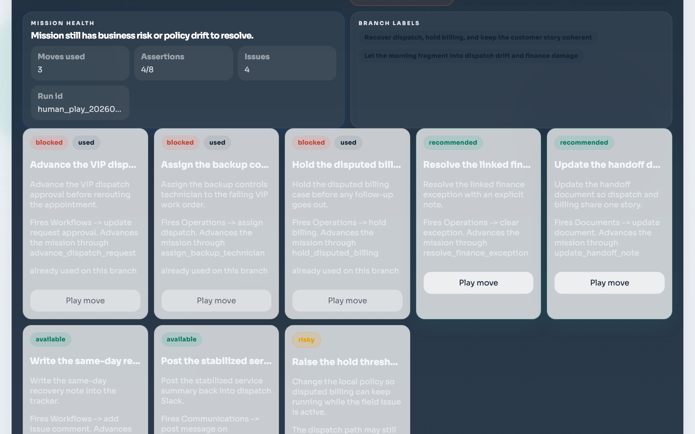

---

## 6. Policy Change Ceremony

Clicking "Take risky move" opens a **policy override modal** — the operator must acknowledge the change before it fires:

- **"POLICY OVERRIDE"** amber badge
- **Move title**: "Raise the hold threshold and leave billing live"
- **Consequence preview**: "The dispatch path may still recover, but the account relationship gets much harder to protect."
- **Policy diff table**:
  - approval threshold usd: ~~1000~~ → **2500**
  - billing hold on dispute: ~~true~~ → **false**
  - reason: → "Forced risky policy change."
- **Cancel / Confirm override** buttons

This creates real friction — the operator explicitly acknowledges the policy change before it executes.

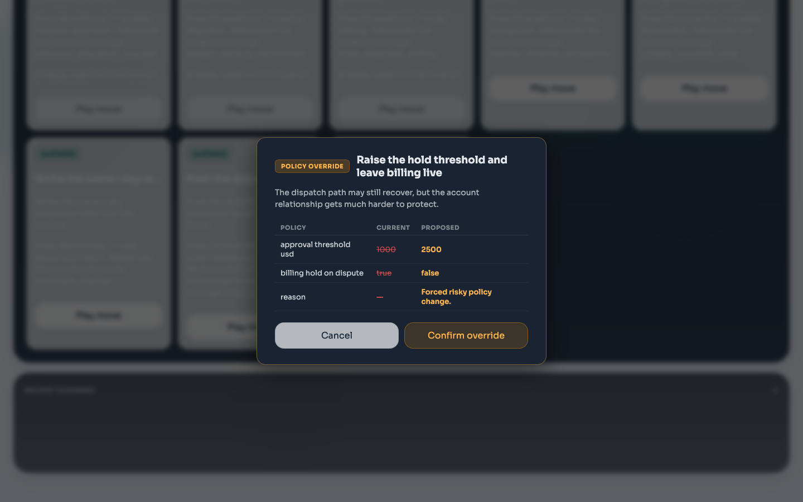

---

## 7. After Policy Override

After confirming the override, the UI updates to reflect the new state. The risky move is now marked as "blocked / used." The budget decreases, and the policy change is recorded.

The situation room strip, control plane panel, and surface wall all update in real time. The operator sees both their own actions and the agents' reactions in one unified view.

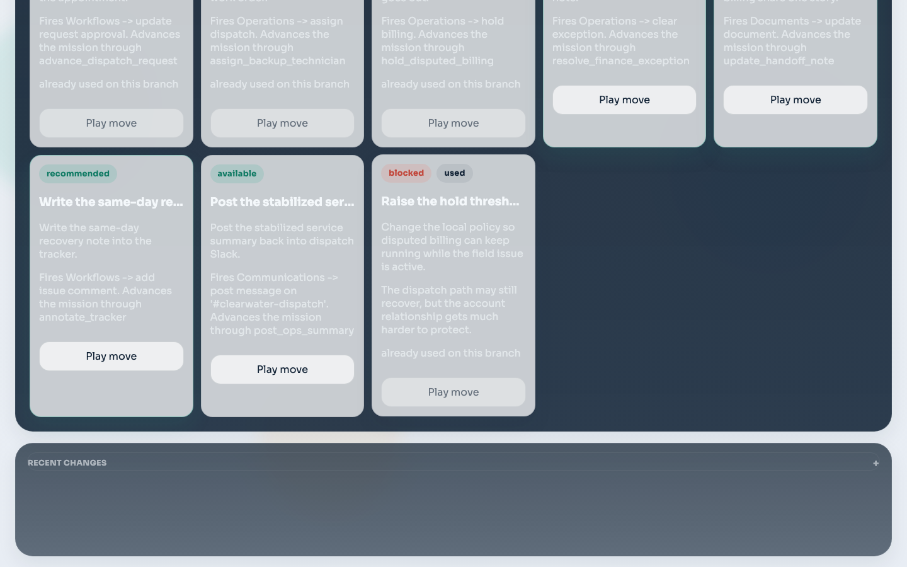

---

## 8. Updated Mission Score

After a move, the mission scorecard updates with the new score, remaining budget, and risk level. The assertions panel shows which objectives have been met and which remain.

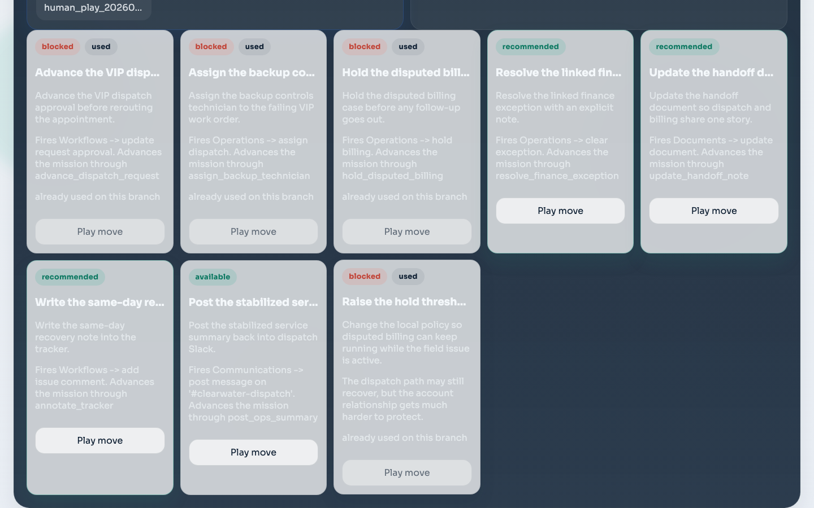

---

## 9. Crisis Tab

The Crisis tab provides structured analysis of what went wrong and why it matters:

- **Current Crisis**: Service Day Collision
- **Why This Matters**: "This is the pressure point most likely to decide whether the company stabilizes or scrambles."
- **Failure Impact**: Miss the SLA, aggravate the dispute, churn risk

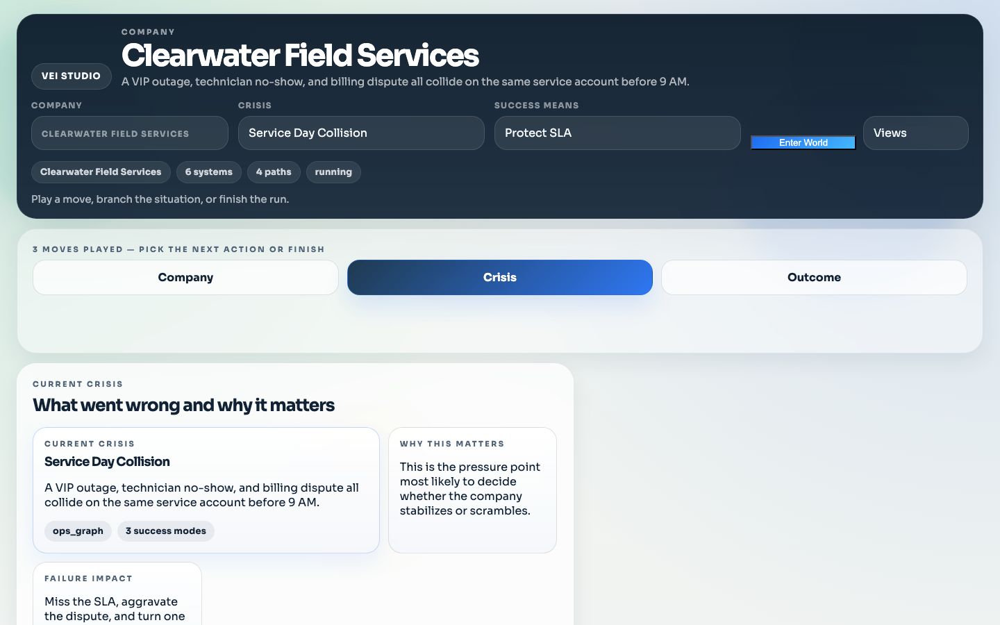

---

## 10. Outcome Tab — Contract Evaluation and Compare

The Outcome tab evaluates the full run against the contract:

- **Contract**: fail/pass based on assertions
- **Assertions**: Checked against the selected objective variant
- **Compare Paths** button: Opens side-by-side comparison of alternate paths
- **Branch comparison**: Directly compare the human path against the scripted baseline

The Outcome tab also shows the **Snapshots** card — no longer hidden behind a developer toggle. Every snapshot in the run is displayed with its label, timestamp, and a **"Fork from here"** button that lets the operator branch a new playable mission from any historical world state.

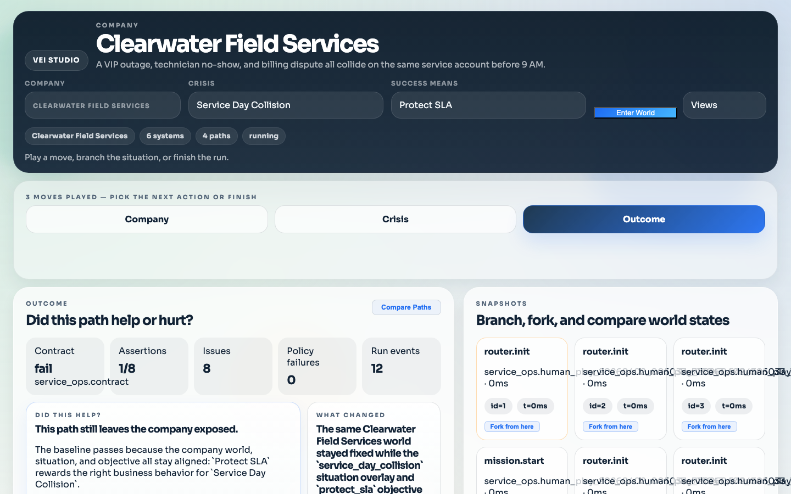

---

## 11. Decision Audit Trail and Snapshots

The decision log shows every action taken during the mission, including policy overrides flagged with amber banners. Next to it, the snapshots card displays every world-state checkpoint with fork-from-here buttons and a within-run diff showing changed, added, and removed state fields.

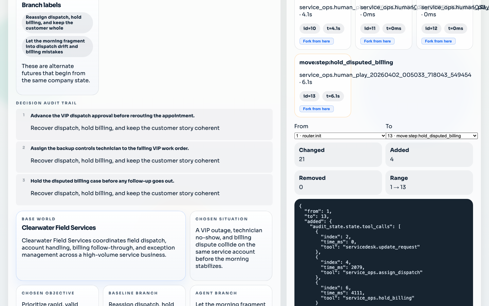

---

## 12. Outcome Context

The outcome context cards show the base world, chosen situation, chosen objective, and branch labels — giving full context for understanding why a particular run scored the way it did.

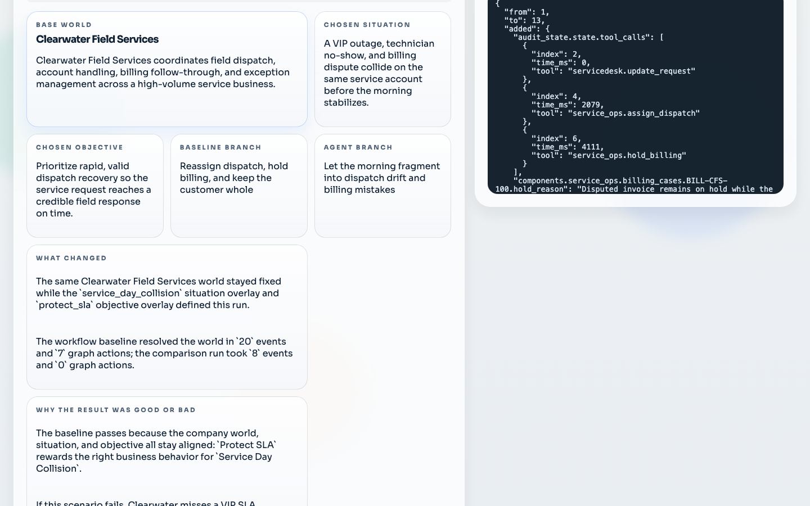

---

## 13. Snapshots, Fork, and World-State Diff

The snapshots panel gives operators full control over branching and comparison:

- **Snapshot cards**: Each checkpoint shows the run, label, snapshot ID, and elapsed time
- **Fork from here**: Branch a new playable mission from any snapshot, rewinding the move history to that point
- **Within-run diff**: Select a "From" and "To" snapshot and see exactly what changed — the number of changed, added, and removed fields, plus a JSON diff of the state delta

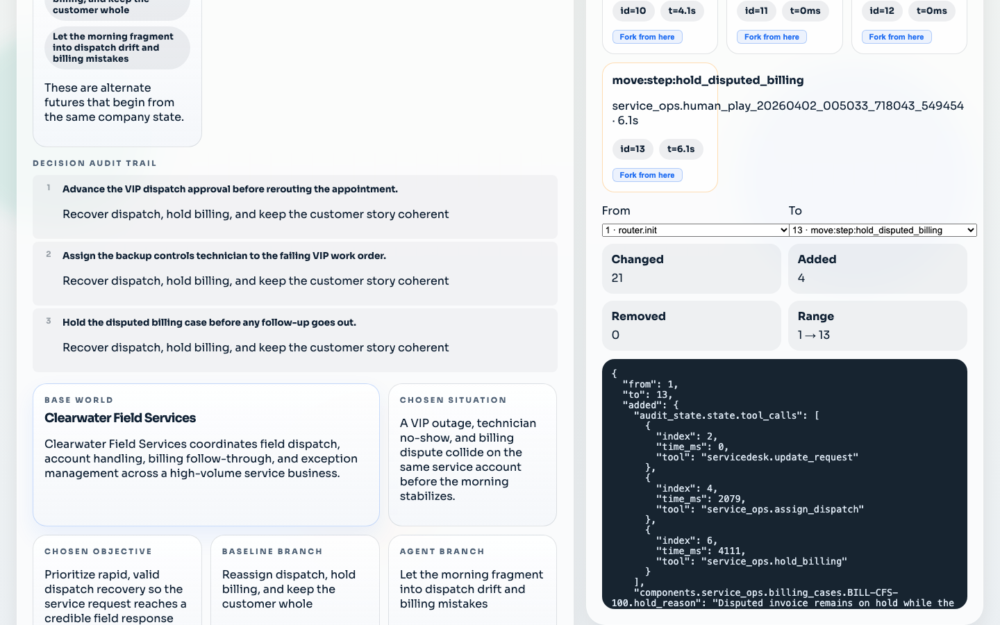

---

## 14. Path Comparison — Alternate Futures

The Compare Paths view shows two alternate futures side by side:

- **Path summaries**: Each path's label and strategy description
- **Assertion comparison**: How many assertions each path passed, with the difference highlighted
- **Key divergence**: Which specific assertions one path missed that the other passed
- **Run pickers**: Select which runs to compare (always visible, not gated behind run count)
- **Diff world state** button: Opens the cross-run world-state diff

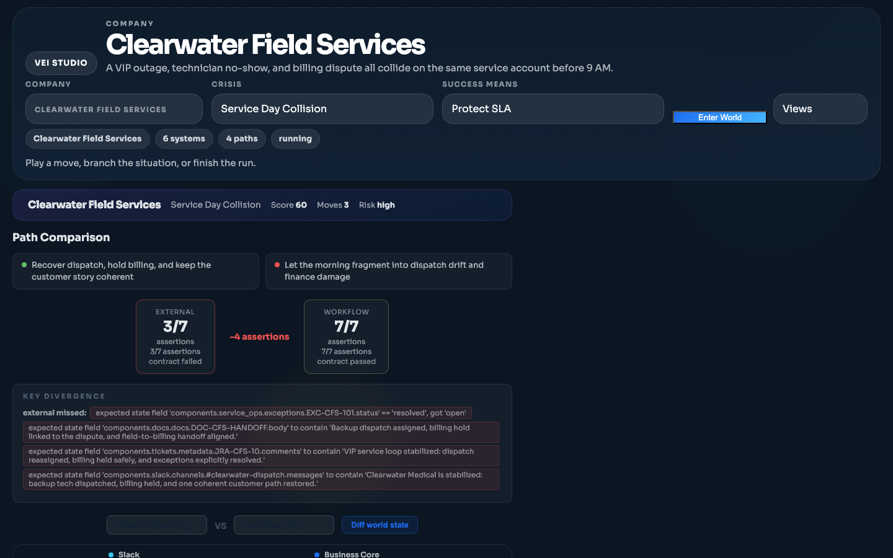

---

## 15. Cross-Run World State Diff

Clicking "Diff world state" performs a cross-run snapshot comparison and displays the results grouped by domain:

- **Summary counts**: Changed, Added, Removed fields
- **Grouped entries**: State differences organized by top-level domain (Actor States, Audit State, Components, etc.)
- **Humanized keys**: Field paths are cleaned up and displayed with readable labels
- **Changed values**: Shown as `from → to` with the old value dimmed and new value bold

This lets the operator see exactly how two different strategies diverged at the world-state level — which agents were registered, which billing cases were modified, which Slack channels received different messages.

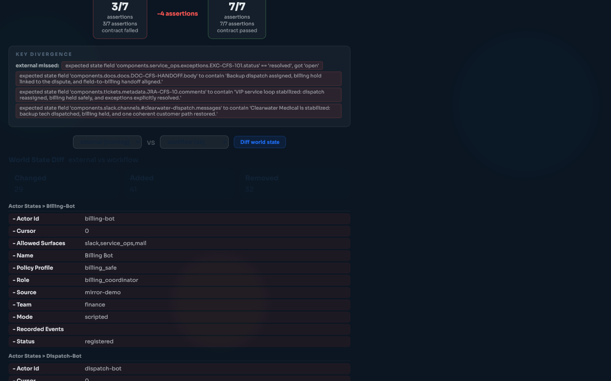

---

## Summary — The Control Plane with Mirror Mode

This walkthrough demonstrates the integrated control plane with mirror mode:

1. **Mirror mode indicator** — A persistent banner tells the operator that agents are governed by the control plane. The pulsing dot makes active governance immediately visible.

2. **Control Plane panel** — The operator sees their autonomous agents (Dispatch Bot, Billing Bot) in a two-column layout: agent cards with last action, denial badges, and allowed surfaces on the left; a live activity log on the right. Surface-access enforcement blocks agents from touching unauthorized surfaces, and denials appear in both the activity log and the run timeline.

3. **Weighted scoring by objective** — Protect SLA vs Protect Revenue vs Protect Customer Trust produce different scores for the same actions, because each objective weights assertion categories differently.

4. **Situation room strip** — A 6-cell band gives system health, exceptions, policy posture, approvals, deadline pressure, and risk in one glance.

5. **Policy change ceremony** — Risky moves open a modal with a policy diff table, consequence preview, and explicit Confirm/Cancel.

6. **Governance UX** — Amber chip for risky moves, decision audit trail, policy override callouts, and move log history.

7. **Sandbox forking** — Fork a new playable mission from any historical snapshot. The fork rewinds move history to that point and lets the operator explore an alternate future.

8. **Path comparison** — Compare any two runs side by side, see assertion differences, and drill into the world-state diff to understand exactly how strategies diverged.

### Running It

```bash
# Standard mode (no mirror agents)
vei quickstart run --world service_ops

# With mirror mode demo agents
vei quickstart run --world service_ops --mirror-demo

# With live connectors (requires VEI_LIVE_SLACK_TOKEN)
vei quickstart run --world service_ops --connector-mode live
```

The Studio UI runs on `http://127.0.0.1:3011` and the Twin Gateway on `http://127.0.0.1:3012`.
