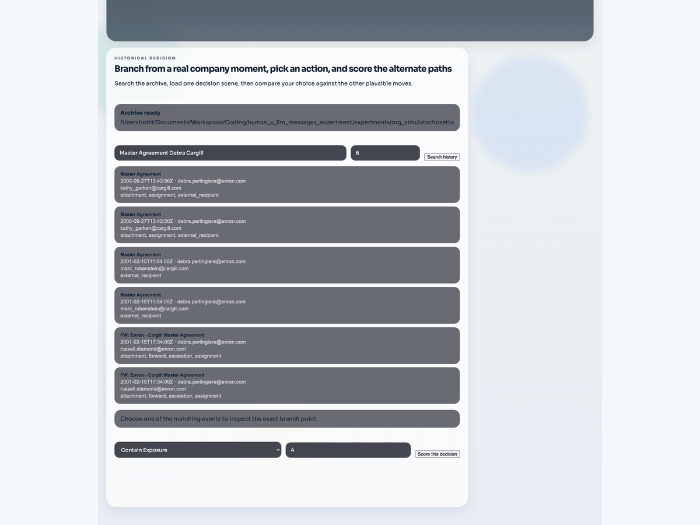
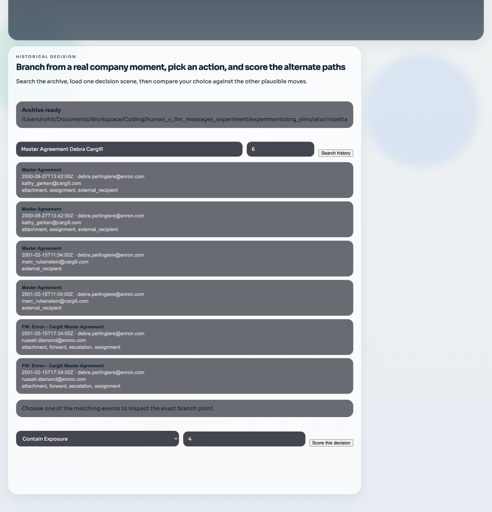
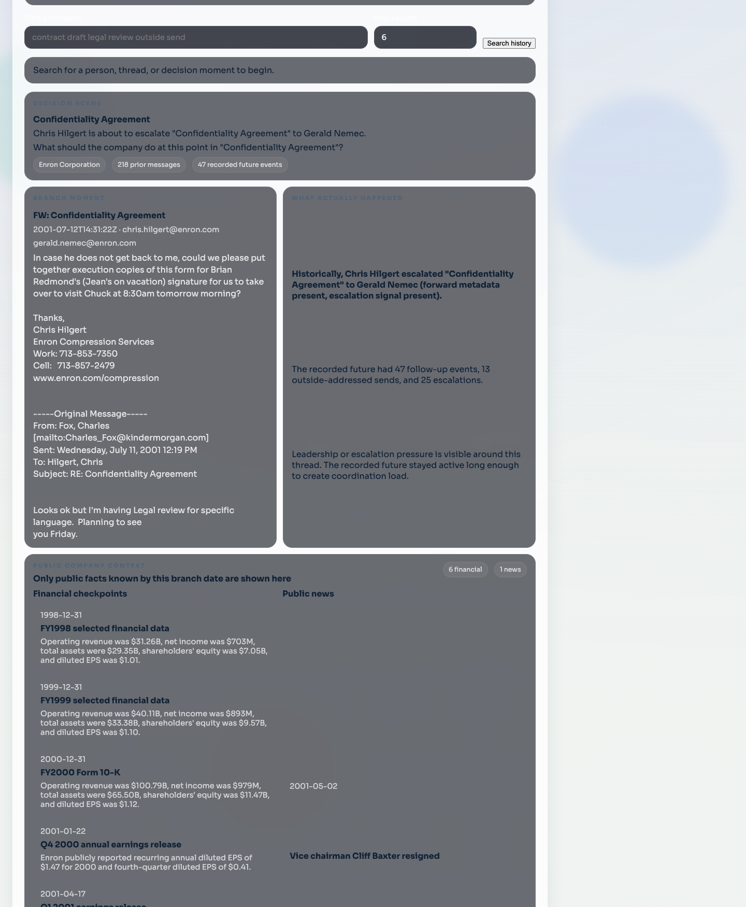
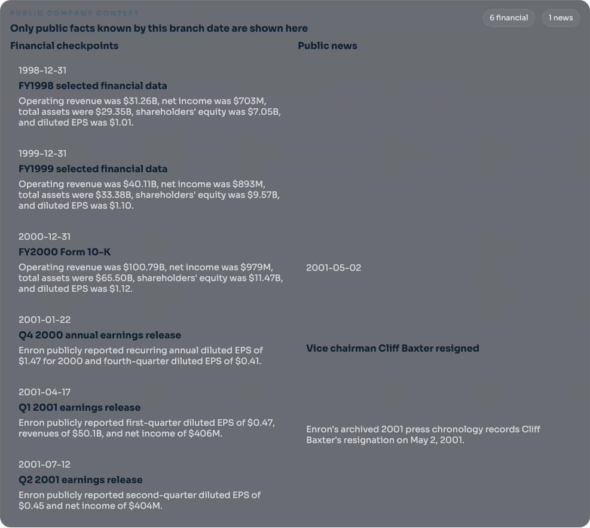

# Historical What-Ifs

VEI now supports a mail-first historical what-if workflow for archive-backed datasets such as the Enron Rosetta event tables.

The flow has four steps:

1. Explore the whole history to see what a rule or intervention would have touched.
2. Pick one exact historical event.
3. Materialize that event's thread into a strict historical workspace.
4. Compare the baseline future against one or more counterfactual paths.

Studio now supports this same loop directly:

1. search the archive for a real historical moment
2. choose one event from the results
3. materialize the baseline workspace
4. run the counterfactual and inspect the saved comparison bundle

## Why this shape

VEI does not try to turn an entire historical corpus into one giant always-running simulation. That would be slower, heavier, and harder to understand in a demo.

Instead, the system uses two connected layers:

- **Whole-history analysis** for broad questions such as “what would this policy have caught?”
- **Event-level replay** for one chosen moment, where VEI can branch, replay, and compare outcomes inside a normal world workspace

This keeps the whole-history pass deterministic and cheap while still giving us a true replay environment for the interesting moment.

## What gets materialized

When VEI opens a historical episode, it builds a mail-first workspace from the selected thread:

- messages before the selected event become the initial mail state
- the selected event and later historical messages become scheduled replay events
- observed thread participants become identity records
- policy-relevant annotations stay attached for analysis and scoring

The important constraint is honesty:

- VEI does **not** invent Slack history for archive-backed email episodes
- VEI keeps historical body excerpts labeled as excerpts when the source data is truncated
- unsupported surfaces stay disabled instead of being faked

## Compare paths

There are two compare paths today:

- **LLM actor continuation**
  - bounded email-only continuation on the affected thread
  - limited to the known thread participants and allowed recipients
  - defaults to `gpt-5-mini` so the interactive run completes quickly and predictably
  - useful for “what would someone have said or done next?”
- **E-JEPA forecast**
  - real checkpoint-backed forecast for risk and volume deltas when the local `ARP_Jepa_exp` runtime is available
  - trained on a deterministic local slice of related threads around the chosen branch point, so the forecast stays tied to the exact decision you are changing
  - falls back to the proxy forecast only when that runtime is missing or errors
  - useful for “how much would this likely reduce exposure, escalation, or follow-up volume?”

## CLI

```bash
# Whole-history analysis
vei whatif explore \
  --rosetta-dir /path/to/rosetta \
  --scenario compliance_gateway \
  --format markdown

# Search for exact branch points
vei whatif events \
  --rosetta-dir /path/to/rosetta \
  --actor vince.kaminski \
  --query "btu weekly" \
  --flagged-only \
  --format markdown

# Build a replayable episode from one exact event
vei whatif open-episode \
  --rosetta-dir /path/to/rosetta \
  --root _vei_out/whatif/enron_case \
  --event-id evt_1234

# Replay the historical future
vei whatif replay \
  --root _vei_out/whatif/enron_case \
  --tick-ms 600000

# Run the full counterfactual experiment
vei whatif experiment \
  --rosetta-dir /path/to/rosetta \
  --artifacts-root _vei_out/whatif_experiments \
  --label master_agreement_internal_review \
  --event-id evt_1234 \
  --model gpt-5-mini \
  --forecast-backend e_jepa \
  --ejepa-epochs 1 \
  --ejepa-batch-size 64 \
  --counterfactual-prompt "Keep the draft inside Enron, loop in Gerald Nemec for legal review, and hold the outside send until the clean version is approved."
```

## Artifacts

`vei whatif experiment` writes a result bundle that includes:

- experiment result JSON
- experiment overview Markdown
- LLM path JSON
- forecast path JSON
- the strict replay workspace used for the run

The forecast bundle is written as `whatif_ejepa_result.json` when the real JEPA path runs, or `whatif_ejepa_proxy_result.json` when the fallback path is used.

This makes it easy to inspect the result in Studio later, compare runs, or hand the output to another tool.

For Enron, VEI also ships a packaged public-company context fixture under `vei/whatif/fixtures/enron_public_context`. Refresh it with `python scripts/prepare_enron_public_context.py`. The current fixture carries 7 dated financial checkpoints and 7 dated public news events from 7 archived public source files, spanning December 31, 1998 through December 2, 2001. VEI slices that fixture to the active Enron email window and then to the chosen branch date before it is shown in Studio, written into the saved episode manifest, added to the LLM counterfactual prompt, or attached to benchmark dossiers.

## Current Studio flow

The current combined Enron setup has two repo-owned inputs:

- the Rosetta mail archive for branch history and recorded futures
- the packaged public-company context fixture for dated financial and public-news facts

The screenshots below were refreshed from the real local Enron archive. The search example uses the `Master Agreement` thread. The decision-scene example uses the July 12, 2001 `FW: Confidentiality Agreement` branch (`enron_e9dc5f3ac8e91c03`), which is late enough to show both financial checkpoints and public news.







The public-company panel is its own dated slice. Earlier branches only show the rows that were already public at that time. If nothing public had landed yet, the panel stays visible and says so. Later 2001 branches show both columns.



## Live Enron display in Studio

Use the repo-owned saved Enron example directly when you want the screen to show Enron itself from a fresh clone.

```bash
vei ui serve \
  --root docs/examples/enron-master-agreement-public-context/workspace \
  --host 127.0.0.1 \
  --port 3055
```

Open `http://127.0.0.1:3055` and stay inside that workspace. This keeps the display tied to the actual Enron branch point and the actual saved result.

The committed example bundle also carries:

- `whatif_experiment_overview.md`
- `whatif_llm_result.json`
- `whatif_ejepa_result.json`

Those files live under `docs/examples/enron-master-agreement-public-context/` beside the saved workspace. The branch date is September 27, 2000, so the saved scene shows 2 financial checkpoints and 0 public-news items. Use the real Rosetta archive when you want whole-history Enron search or a new run from the full corpus.

## Enron business-outcome benchmark

The historical replay flow above is for one branch point and one saved comparison. The Enron benchmark is for repeated measurement across many branch points.

This benchmark answers a different question:

- given only the history before the branch point
- and one structured candidate action
- what later business-relevant email evidence becomes more or less likely

The benchmark keeps the older replay and ranked what-if flows intact. It adds a separate benchmark path for business-facing proxy outcomes:

- `enterprise_risk`
- `commercial_position_proxy`
- `org_strain_proxy`
- `stakeholder_trust`
- `execution_drag`

Those scores come from later email evidence that the archive can actually support:

- outside spread
- legal burden
- executive heat
- coordination load
- decision drag
- trust or repair language
- conflict heat
- artifact churn

All trained model families use the same boundary for this benchmark:

- pre-branch thread history only
- structured candidate action only

The held-out Enron dossiers now include dated public financial checkpoints and public news items that were already known by the branch date. That public context helps the judge and the audit workflow. It does not change the model-training contract in this pass.

The matched-input benchmark study now gives `jepa_latent` and `full_context_transformer` the same pre-branch event sequence, summary features, and action schema. That makes the main rerun a clean model comparison instead of a mixed input comparison.

### Benchmark commands

```bash
# Build the factual dataset and the held-out Enron case pack
vei whatif benchmark build \
  --rosetta-dir /path/to/rosetta \
  --artifacts-root _vei_out/whatif_benchmarks/branch_point_ranking_v2 \
  --label enron_business_outcome_public_context_20260412

# Train one model family
vei whatif benchmark train \
  --root _vei_out/whatif_benchmarks/branch_point_ranking_v2/enron_business_outcome_public_context_20260412 \
  --model-id jepa_latent

# Judge the held-out counterfactual cases from dossiers only
vei whatif benchmark judge \
  --root _vei_out/whatif_benchmarks/branch_point_ranking_v2/enron_business_outcome_public_context_20260412 \
  --model gpt-4.1-mini

# Evaluate the trained model against factual futures and judged rankings
vei whatif benchmark eval \
  --root _vei_out/whatif_benchmarks/branch_point_ranking_v2/enron_business_outcome_public_context_20260412 \
  --model-id jepa_latent \
  --judged-rankings-path _vei_out/whatif_benchmarks/branch_point_ranking_v2/enron_business_outcome_public_context_20260412/judge_result.json \
  --audit-records-path /path/to/completed_audit_records.json

# Run the matched-input study across multiple models and seeds
vei whatif benchmark study \
  --root _vei_out/whatif_benchmarks/branch_point_ranking_v2/enron_business_outcome_public_context_20260412 \
  --label matched_input_public_context_20260412 \
  --model-id jepa_latent \
  --model-id full_context_transformer \
  --model-id treatment_transformer \
  --seed 42042 \
  --seed 42043 \
  --seed 42044 \
  --seed 42045 \
  --seed 42046 \
  --epochs 2
```

### What gets written

`vei whatif benchmark build` writes:

- factual train, validation, and test rows built from observed Enron futures
- a held-out Enron case pack
- one dossier per case and per business objective
- a judged-ranking template
- an audit template

`vei whatif benchmark judge` writes:

- `judge_result.json`
- `audit_queue.json`

`vei whatif benchmark eval` writes:

- factual forecasting metrics
- judged counterfactual ranking metrics
- audit coverage and agreement metrics
- rollout stress metrics only as a separate section

`vei whatif benchmark study` writes:

- one aggregate JSON result
- one Markdown overview
- one seeded run folder per model under `studies/<label>/runs/...`

### Current model state

The current saved Enron public-context build uses 24 held-out cases with 4 candidate actions each. The headline result now comes from the matched-input study rerun over that build rather than from the older single-run comparison.

The held-out dossiers now also carry the dated Enron public-company backdrop that was already public by each branch date. That richer context is for replay, judging, and audit review. The model-training inputs stay the same in this pass.

On the current 5-seed, 2-epoch matched-input rerun, the held-out decision checks came out like this:

- `jepa_latent`: `80.2/120` mean, `0.668 +/- 0.012`
- `full_context_transformer`: `79.4/120` mean, `0.662 +/- 0.031`
- `treatment_transformer`: `68.2/120` mean, `0.568 +/- 0.117`

On the factual question of whether anything goes outside after the branch point, all three models stayed tightly grouped around `0.98` AUROC: `0.981` for `jepa_latent`, `0.982` for `full_context_transformer`, and `0.980` for `treatment_transformer`.

The main point is that the fair rerun still favors the JEPA-style path on the Enron decision checks once the models read the same pre-branch contract and the result is averaged across seeds, while the treatment transformer shows the widest spread from seed to seed.

### Important constraint

This benchmark stays honest about the source data. Enron email can support business proxies. It does not support true profit ground truth or true HR outcome ground truth.
